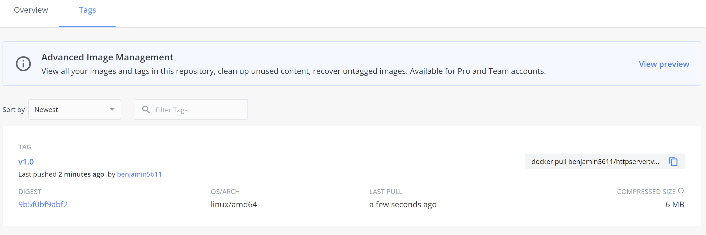
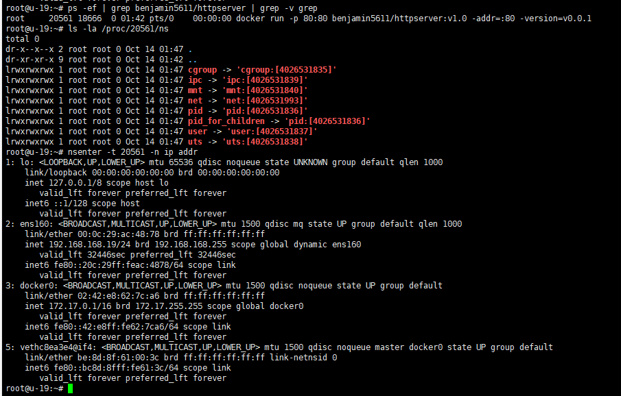

# httpserver

- [httpserver](#httpserver)
  - [1.作业一](#1作业一)
  - [2.作业二](#2作业二)

## 1.作业一

在当前目录下

Docker 运行:

```bash
$ make run-image-local
```

二进制运行 (需要管理员权限，适用于 Linux，MacOS，Windows10 WSL2 上运行)：

```bash
$ make run
```

httpserver 启动后，访问 http://localhost/healthz

当然是看不到什么的，要用单元测试验证代码的正确性，[这里](https://github.com/startdusk/cncamp-homework/blob/master/httpserver/handler/handler_test.go)

## 2.作业二

1.构建本地镜像

```bash
$ make build-image
```

2.编写 Dockerfile 将编写的 httpserver 容器化，请思考有哪些最佳实践可以引入到 Dockerfile 中来：[这里](https://github.com/startdusk/cncamp-homework/blob/master/httpserver/Dockerfile)

3.推送到 DockerHub:

```bash
$ make upload-image
```

推送结果：


4.Docker 本地启动 httpserver:

```bash
$ make run-image-local
```

5.通过 nsenter 进入容器查看 IP 配置：

拉取 DockerHub 上的镜像

```bash
$ make run-image # 我这里主要还是为了检查上传到DockerHub的镜像是否能用，所以在makefile里面拉取了DockerHub上传了的镜像
```

通过 nsenter 进入容器内查看 IP 配置：

```bash
$ nsenter-t <pid> -n ip addr
```


